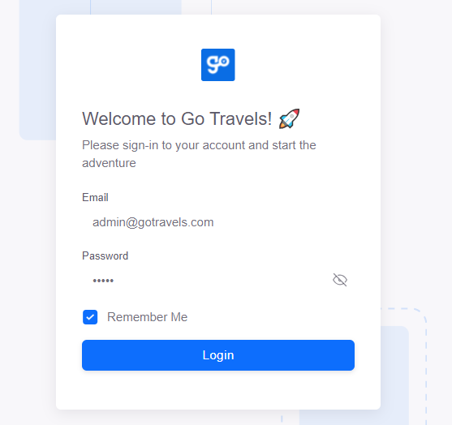
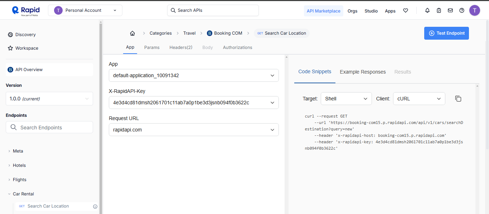
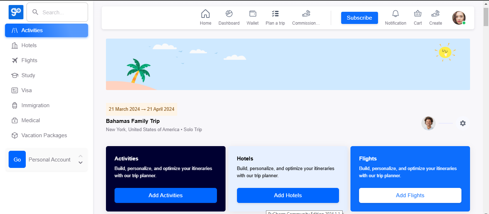

Project Name: GO-VOYATEK-TRAVELS
This is a Next.js frontend project using TypeScript and integrating with RapidAPI. It follows a structured approach to organization and utilizes various Next.js features and best practices.

Table of Contents
Project Structure
Key Features
Technologies Used
Setup Instructions
Contributing
License
 
Description
This project is tailored towards a user friendly interface which helps  Users should be able to search for flights, hotels, and activities and select/add them.

Project Strcture

/
├── public/
│   └── icons/ (SVG files)
├── src/
│   ├── @core/
│   │   ├── Spinner.tsx
│   │   └── BoxLogo.tsx
│   ├── @fake-db/
│   ├── configs/
│   ├── context/
│   ├── hooks/
│   ├── iconify-bundles/
│   ├── layouts/
│   │   ├── ImageLayout.tsx
│   │   ├── AppBar.tsx
│   │   ├── Toolbar.tsx
│   │   └── Topography.tsx
│   ├── navigation/
│   ├── pages/
│   │   └── ...
│   ├── store/
│   ├── types/
│   └── views/
└── package.json

This structure separates concerns and organizes code logically, with a clear separation between public assets and source code.

Key Features
TypeScript: Ensures type safety throughout the project.
Next.js 14+ App Router: Utilizes the latest Next.js features for routing and layout management.
Custom Layouts: Reusable layouts for consistent design across pages.
Icon System: Uses SVG icons stored in the public directory.
State Management: Centralized state handling with Redux or Zustand.
Server Actions: Leverages Next.js server actions for API calls.
RapidAPI Integration: Utilizes RapidAPI for external data fetching.

Technologies Used
Next.js 14+
TypeScript
React
MUI (Material-UI) components
Redux or Zustand for state management
Iconify for icon system
RapidAPI for external data integration

Setup Guide

github repository https://github.com/Dharkwhale/GO-VOYATEK-TRAVELS.git
hosting link.. https://go-voyatek-travels.vercel.app/

Install dependencies:

$npm install

Start the development server:

$npm run dev

Production Build

$npm run build

Contributing Guide
While building this website i consumed the booking API from RapidAPI.com and i used mockAPI to build the login page that leads to the landing page

